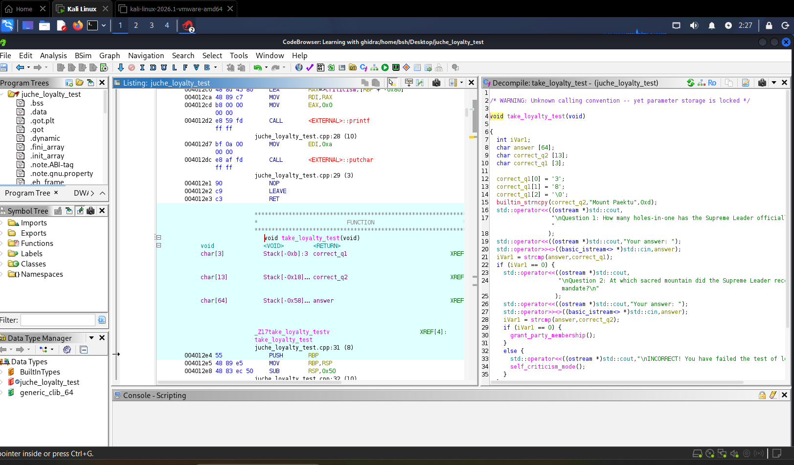
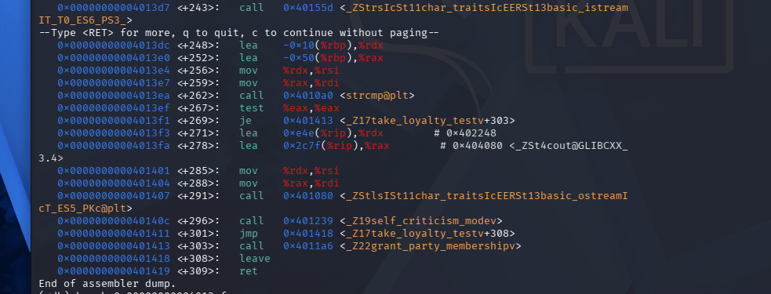

# 🔍 Writeup: DPRK Loyalty Evaluation (CrackMe)

## 📌 Challenge Overview
A solution for the **DPRK Loyalty Evaluation** challenge on Crackmes.one. This writeup demonstrates two approaches: identifying the logic via **Static Analysis (Ghidra)**, and actively bypassing conditional logic using **Dynamic Register Manipulation (GDB)**.

| Attribute | Details |
| :--- | :--- |
| **Challenge Name** | DPRK Loyalty Evaluation |
| **Author** | 23x41 |
| **Platform** | Crackmes.one |
| **Difficulty Level** | 1.2 |
| **Architecture** | x86 (ELF 64-bit Executable) |
| **Language** | C++ |
| **Tools Used** | Ghidra, GDB |

---

## 🛠️ Static Analysis (Ghidra)

1. **Control Flow & Structure:**
   - Decompiled `main()` to observe basic anti-debugging mechanics (`ptrace`).
   - Inspected `take_loyalty_test()` which prompts for two specific questions and validates responses using `strcmp()`.



2. **Extracted Key Info:**
   - Question 1 Answer: `38`
   - Question 2 Answer: `Mount Paektu`

---

## 🔬 Dynamic Execution & Register Patching (GDB)

Rather than passing the expected string for Question 2, the challenge was solved by dynamically manipulating the return value register in memory.

### **1. Disassembly Analysis**
Inspecting assembly instructions for `take_loyalty_test` revealed the `strcmp` call followed by the conditional jump instruction `je`.



* **Key Instruction:** `0x4013ef: test %eax, %eax`
* **Jump Condition:** `0x4013f1: je 0x401413` (Jumps to `grant_party_membership` if `$eax == 0`).


### **2. Register Manipulation & Bypass**

1. Set a breakpoint right before the test instruction:
   ```gdb
   (gdb) break *0x4013ef
    ```
  2. Executed the binary, answered Question 1 (38), and passed arbitrary input (vvv) for Question 2.

  3. Inspected $eax at the breakpoint, which held a non-zero error value (41), then forced it to 0:

Code snippet
```gdb
(gdb) p $eax
$8 = 41
(gdb) set $eax = 0    (gdb) p$eax
$9 = 0
```
4. Continued execution (continue), bypassing the check and retrieving the flag.
---

##🔑 Flag
FLAG{0x8A7_JUCHE_FORMAT_STRING_MASTERY}


---


##💡 Key Takeaways
**Register Manipulation:** Demonstrates how modifying general-purpose registers ($eax) in a debugger can cleanly bypass authentication/logic checks without altering binary bytes on disk.

**Calling Conventions:** Leveraging understanding of x86_64 ABI return registers to alter control flow dynamically.

---
