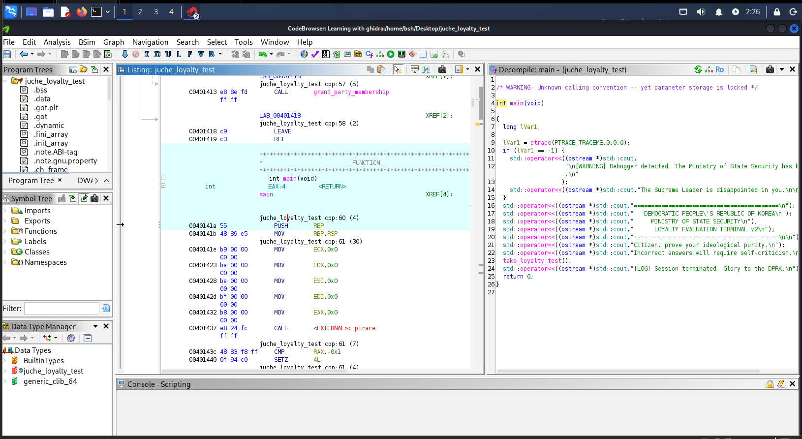

# 🔍 Writeup: DPRK Loyalty Evaluation (CrackMe)

## 📌 Challenge Overview
A static reverse engineering analysis for the **DPRK Loyalty Evaluation** challenge on Crackmes.one. The target binary uses basic static checks and hardcoded string variables to grant access to the final flag function.

| Attribute | Details |
| :--- | :--- |
| **Challenge Name** | DPRK Loyalty Evaluation |
| **Author** | 23x41 |
| **Platform** | Crackmes.one |
| **Difficulty Level** | 1.2 |
| **Architecture** | x86 (ELF 64-bit Executable) |
| **Language** | C / C++ |
| **Tools Used** | Ghidra |

---

## 🛠️ Static Analysis & Triage

1. **Initial File Inspection:**
   - The target binary was loaded into Ghidra for disassembly and decompilation.
2. **Main Function Structure (`main`):**
   - Inspecting the `main` function reveals anti-analysis mechanics using `ptrace(PTRACE_TRACEME)` to detect debuggers.
   - If no debugger is present, `main` executes `take_loyalty_test()`.



---

## 🔬 Reverse Engineering Logic Flow

### 1. Analyzing `take_loyalty_test()`
By navigating to the `take_loyalty_test()` function, we can see two questions being asked via standard input:

- **Question 1:** *"How many holes-in-one has the Supreme Leader officially scored?"*
  - **Hardcoded Answer (`correct_q1`):** `38`
- **Question 2:** *"At which sacred mountain did the Supreme Leader receive his mandate?"*
  - **Hardcoded Answer (`correct_q2`):** `Mount Paektu`

```cpp
// Hardcoded answer assignments in take_loyalty_test()
correct_q1[0] = '3';
correct_q1[1] = '8';
correct_q1[2] = '\0';
builtin_strncpy(correct_q2, "Mount Paektu", 0xd);
```


Both answers are verified using strcmp(). Passing both comparisons successfully routes execution directly to grant_party_membership().

2. Extracting the Flag (grant_party_membership())
Navigating to grant_party_membership() reveals that the flag is hardcoded directly into the print output stream (std::cout):

C++
```cpp
void grant_party_membership(void) {
    std::operator<<(std::cout, "\n[GLORIOUS VICTORY]\n");
    std::operator<<(std::cout, "FLAG{0x8A7_JUCHE_FORMAT_STRING_MASTERY}\n");
    system("/bin/sh");
}
```

🔑 Solution & Flag
Question 1 Input: 38

Question 2 Input: Mount Paektu
```cpp
Flag: FLAG{0x8A7_JUCHE_FORMAT_STRING_MASTERY}
```
💡 Key Takeaways
Static Analysis Power: Disassemblers like Ghidra allow complete bypass of interactive prompts by reversing memory variables without needing active execution or dynamic debugging.

Anti-Debugging Awareness: Identified how simple ptrace checks attempt to block debuggers at the start of main().
