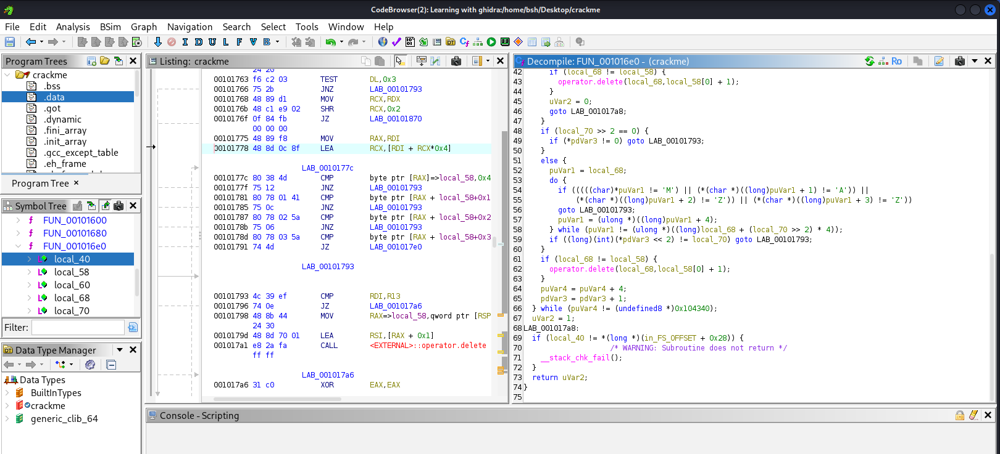
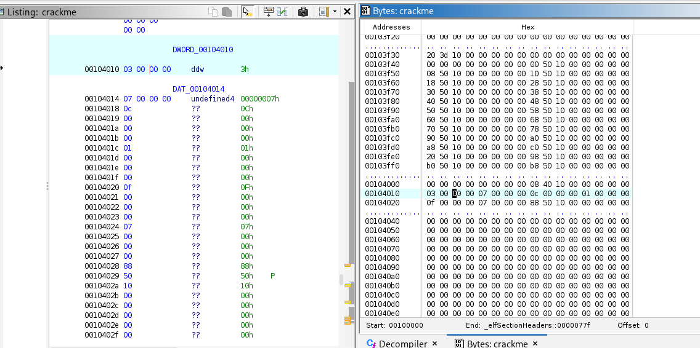
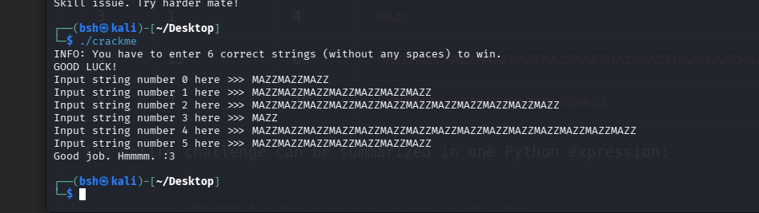

# 🔍 Walkthrough & Reverse Engineering: C++ Verification Logic

## 📌 Challenge Overview

This write-up provides an in-depth analysis of a **Linux ELF 64-bit C++ crackme challenge**. The main objective is to reverse-engineer the input validation logic by analyzing the binary in **Ghidra** and extracting the required parameters directly from the `.data` section.
| Attribute | Details |
| :--- | :--- |
| **Challenge Name** | Mazzotti's Multi-layer password check |
| **Author** | Mazzotti |
| **Platform** | Crackmes.one (Unix/Linux etc.) |
| **Difficulty Level** | 1.8 |
| **Architecture** | x86-64 |
| **Language** | C/C++ |
| **Tools Used** | Ghidra |

---

## 🛠️ Main Control Flow — `FUN_001012b0`

Initial inspection of `FUN_001012b0` establishes the application's input and verification flow.

### 1. Input Loop

The application prompts the user to enter **6 individual strings** without spaces.

The inputs are stored in memory starting at:

```text
DAT_00104280
```

### 2. Verification Call

After all six strings are submitted, execution proceeds to:

```text
FUN_001016e0()
```

The function returns:

* `1` → `Good job. Hmmmm. :3`
* `0` → `Skill issue. Try harder mate!`

Therefore, the main goal is to determine the exact six strings expected by `FUN_001016e0()`.

---

## 🔬 Verifier Logic Analysis — `FUN_001016e0`

Although the decompiler output contains a significant amount of C++ standard-library noise (`std::__cxx11::string`, memory allocation, constructors/destructors, etc.), the actual verification logic is relatively simple.



---

## 1️⃣ Hardcoded Pattern Extraction

Inside the processing loop, the binary checks the input in **4-byte chunks**:

```c
if (((((char)*puVar1 != 'M') ||
      (*(char *)((long)puVar1 + 1) != 'A')) ||
      (*(char *)((long)puVar1 + 2) != 'Z')) ||
      (*(char *)((long)puVar1 + 3) != 'Z'))
    goto LAB_00101793;

puVar1 = (ulong *)((long)puVar1 + 4);
```

Each iteration checks whether four consecutive characters match:

```text
M A Z Z
```

If the check succeeds, the pointer advances by **4 bytes** and the next chunk is checked.

### Conclusion

Every valid input must consist entirely of repeated:

```text
MAZZ
```

So the possible structure of each input is:

```text
MAZZ
MAZZMAZZ
MAZZMAZZMAZZ
...
```

---

## 2️⃣ Extracting Repeat Counts from `.data`

The verifier also checks the total length of each input against an integer array stored at:

```text
DAT_00104010
```

The relevant decompiled condition is:

```c
if ((long)(*piVar3 << 2) != local_70)
    goto LAB_00101793;
```

Here:

* `*piVar3` → reads an integer from the array.
* `<< 2` → left-shifts the integer by 2 bits.
* A left shift by 2 is equivalent to multiplying by `4`.
* `local_70` → represents the total length of the submitted string.

Therefore:

```text
required_length = extracted_value × 4
```

Since every valid block is exactly four characters long (`MAZZ`), the extracted values directly represent the **number of `MAZZ` repetitions** required for each input.

---

## 3️⃣ Extracting the Values from `.data`



Inspecting memory at `0x00104010` using Ghidra's **Listing** and **Bytes** views reveals six 32-bit little-endian integers:

| Address      | Raw Bytes     | Integer |
| ------------ | ------------- | ------: |
| `0x00104010` | `03 00 00 00` |     `3` |
| `0x00104014` | `07 00 00 00` |     `7` |
| `0x00104018` | `0c 00 00 00` |    `12` |
| `0x0010401c` | `01 00 00 00` |     `1` |
| `0x00104020` | `0f 00 00 00` |    `15` |
| `0x00104024` | `07 00 00 00` |     `7` |

The extracted sequence is therefore:

```text
3, 7, 12, 1, 15, 7
```

---

# 🔑 Final Solution

Because each repetition of `MAZZ` contains **4 characters**, the required input length for each value is:

```text
count × 4
```

The six required inputs are:

| Index | Count | Required Length | Solution                       |
| ----: | ----: | --------------: | ------------------------------ |
|   `0` |   `3` |            `12` | `MAZZMAZZMAZZ`                 |
|   `1` |   `7` |            `28` | `MAZZMAZZMAZZMAZZMAZZMAZZMAZZ` |
|   `2` |  `12` |            `48` | `MAZZ` repeated 12 times       |
|   `3` |   `1` |             `4` | `MAZZ`                         |
|   `4` |  `15` |            `60` | `MAZZ` repeated 15 times       |
|   `5` |   `7` |            `28` | `MAZZMAZZMAZZMAZZMAZZMAZZMAZZ` |

### Complete Input

For convenience, the complete six-line input can be represented as:

```text
MAZZMAZZMAZZ
MAZZMAZZMAZZMAZZMAZZMAZZMAZZ
MAZZMAZZMAZZMAZZMAZZMAZZMAZZMAZZMAZZMAZZMAZZMAZZMAZZ
MAZZ
MAZZMAZZMAZZMAZZMAZZMAZZMAZZMAZZMAZZMAZZMAZZMAZZMAZZMAZZMAZZMAZZMAZZ
MAZZMAZZMAZZMAZZMAZZMAZZMAZZ
```

---

## 🏆 Successful Execution

Running the binary:

```bash
./crackme
```

and providing the six calculated strings satisfies the validation logic and results in the success message:

```text
Good job. Hmmmm. :3
```

This confirms that the reverse-engineered constraints are correct.



---

# 💡 Key Takeaways

### 1. Reduce C++ Decompiler Noise

A large portion of the decompiled code comes from C++ standard-library functionality, such as:

```text
std::__cxx11::string
_M_create
operator.delete
constructors / destructors
```

These sections can be largely ignored when searching for the actual validation logic.

The important part is the code that directly compares input bytes and lengths.

### 2. Recognize Compiler Optimizations

The expression:

```c
x << 2
```

is equivalent to:

```c
x * 4
```

Recognizing this makes the length-checking logic much easier to understand.

### 3. Analyze Static Data

Instead of brute-forcing the inputs, the required repetition counts can be recovered directly from the binary's `.data` section.

The values:

```text
3, 7, 12, 1, 15, 7
```

combined with the `MAZZ` pattern are enough to reconstruct the complete solution.

### 4. Combine Static and Dynamic Analysis

The challenge becomes straightforward once the two pieces are connected:

```text
.data values
      ↓
3, 7, 12, 1, 15, 7
      ↓
number of MAZZ repetitions
      ↓
required input strings
      ↓
successful verification
```

---

## 🧰 Tools

* **Ghidra** — Static analysis and decompilation
* **Linux** — Execution environment
* **ELF x86_64** — Target binary format

---

## 📁 Files

```text
.
├── crackme
├── images/
│   ├── ghidra_decompilation.png
│   ├── bytes View.png
│   └── Solution.png
└── README.md
```

---

## 📝 Conclusion

This crackme demonstrates a simple but useful reverse-engineering workflow:

1. Identify the main input/verification functions.
2. Ignore C++ standard-library noise.
3. Isolate the actual byte-comparison logic.
4. Identify the required `MAZZ` pattern.
5. Locate the length parameters in `.data`.
6. Interpret the `<< 2` operation as multiplication by four.
7. Reconstruct the six required inputs.
8. Verify the solution by executing the binary.

The final solution is therefore determined entirely through **static analysis of the validation logic and `.data` contents**, without requiring brute force or binary patching.
